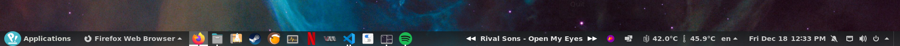

# Spotify Label

This is a quick and dirty GNOME shell extension to show the currently playing song on Spotify and navigate through the current playist.

## Example  


## Installation

It is also possible to download it "manually" by cloning the repository to `~/.local/share/gnome-shell/extensions`, restarting GNOME and enabling the extension using 
``` bash
gnome-extensions enable spotify-manager@ido.github.com
```
This approach is not recommended, and assumes you know your way around the GNOME Extensions ecosystem.

If you still have issues, talk to me! Create an [issue](https://github.com/mheine/gnome-shell-spotify-label/issues/new?title=Installation!&body=Hey!%20I'd%20like%20to%20get%20this%20installed%20on%20my%20system). This is my very first GNOME extension, but I'd be happy to help you set it up on your workstation.

## Features
* Forward and backward buttons to navigate between the songs in the playlist
* Play/stop by clicking the song label
* Display the currently played song label

## Disclaimer
The extension is is currently very tailored to my setup, but if you have questions or comments I'd be more than happy to answer them. There are a few configuration options available in the beginning of `extension.js`, but for more advanced tweaking your best bet is to manually code it.

Have fun!
